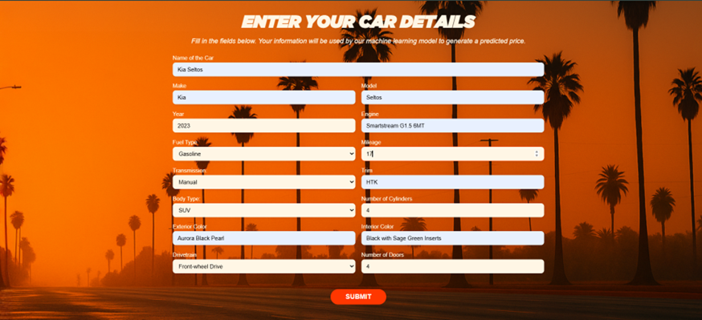

# Vehicle Price Prediction using XGBoost

This project predicts the price of a vehicle based on its specifications using a machine learning model trained on real-world data. It uses an XGBoost Regressor for accurate predictions and provides a clean, interactive frontend built with HTML, CSS, and JavaScript.

---

##  Overview

The goal of this project is to build a robust regression model capable of estimating the market price of a vehicle based on features such as make, model, year, engine type, mileage, and more. A lightweight web interface is also included for professional demonstration and interaction.

---

## Machine Learning Pipeline

- **Model**: `XGBoost Regressor`
- **Target Variable**: `Price` (log-transformed for normalization)
- **Preprocessing**:
  - One-hot encoding of categorical features
  - Log transformation on price
  - Handling missing values and outliers
- **Evaluation Metrics**:
  - R² Score
  - MAPE (Mean Absolute Percentage Error)
  - RMSLE (Root Mean Squared Log Error)

### Model Training Steps

1. Data exploration and cleaning
2. Feature engineering
3. Encoding categorical variables
4. Log-transforming the target for stability
5. Model training with XGBoost
6. Saving:
   - Trained model as `.json`
   - Feature column structure as `.pkl`

---

## Web Interface

While the core of this project is the ML model, a clean web interface was developed for easy usage and demo purposes.

- **Frontend**: HTML, CSS, JS
- **Backend**: Python Flask (API endpoint for prediction)
- **Communication**: JSON-based `POST` requests to `/predict`
- **UI Features**:
  - Landing page
  - Dynamic form input
  - Animated result display 

### Home Page


### Input Page


### Output Page


---

##  Getting Started

### Installation

```bash
git clone https://github.com/yourusername/vehicle-price-prediction.git
cd vehicle-price-prediction
pip install -r requirements.txt
```
---

### Run the Flask App

```bash
python app/app.py
```
---
### Open your browser and visit:
http://127.0.0.1:5000
